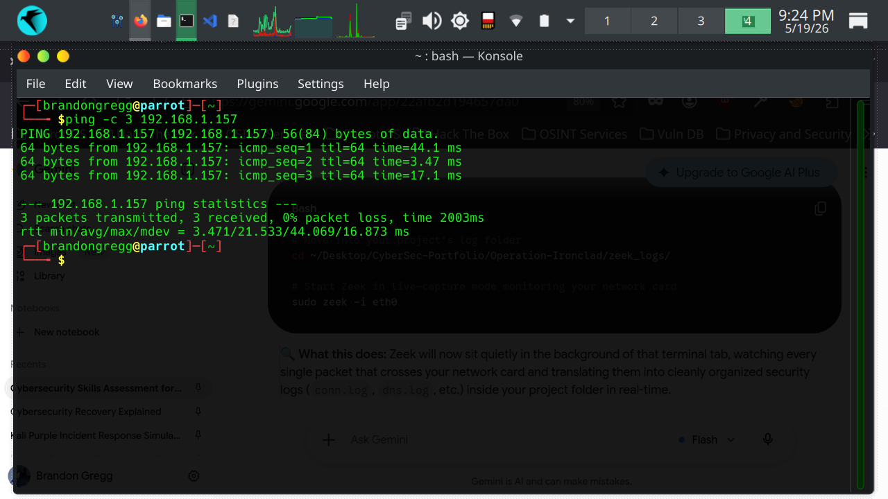
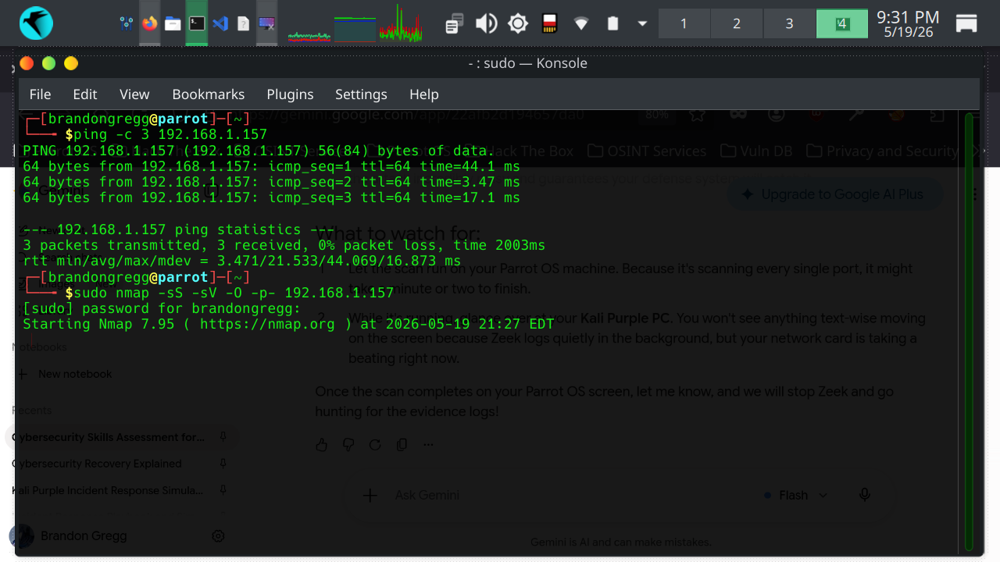
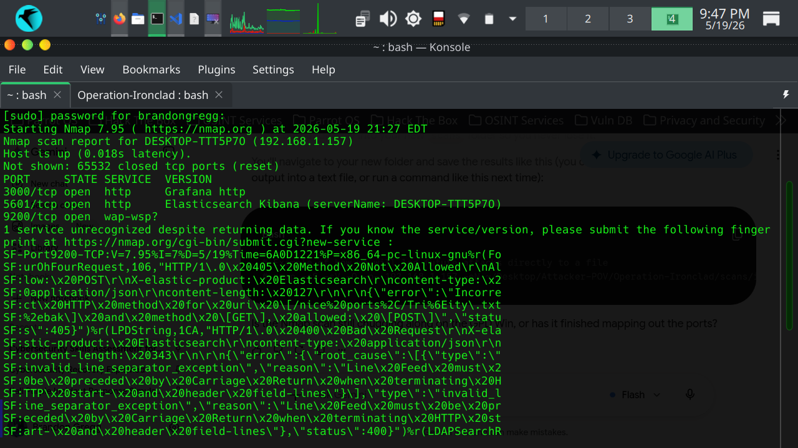
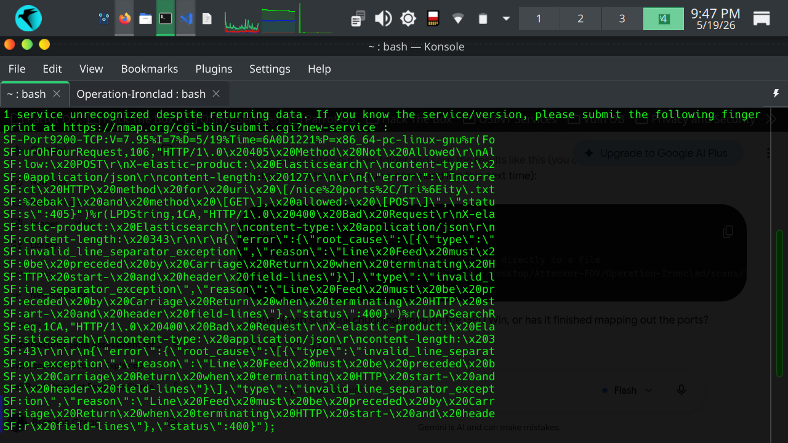
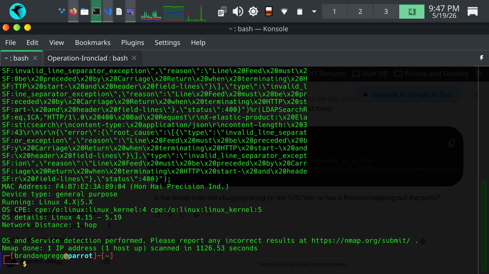

# 🛑 Operation Ironclad: Red Team Emulation Playbook

This directory contains the offensive methodologies, custom automation scripts, and execution logging used to emulate malicious adversarial reconnaissance traffic against the target network architecture.

## 👥 Adversarial Infrastructure
* **Attacking Node:** GPD Win 1 Mobile Tactical Unit
* **Target Interface Scope:** Subnet Local Asset Space
* **Adversarial Footprint:** Multi-threaded socket synchronization looping across sequential port ranges to force massive baseline divergence.

---

## 📈 Execution Timeline & Evidence Verification

To maintain strict operational transparency and documentation honesty, the offensive phase was recorded across its entire execution lifecycle from the attacker's terminal interface:

### 1. Pre-Attack Baseline Validation
Before initializing high-velocity traffic loops, an ICMP echo reply check was conducted to confirm stable routing and definitive visibility of the target environment.
* **File:** `evidence/ping_test_sucess.png`
* **Status:** **SUCCESS** — Target responsive with stable round-trip delivery times.

### 2. Reconnaissance Engine Initialization
The custom multi-threaded socket reconnaissance framework was launched to begin rapid discovery scans across target asset arrays.
* **File:** `evidence/attacker_terminal_begin.png`
* **Status:** **ACTIVE** — Network sockets initializing across target ports.

### 3. Sustained Scanning Progression (Chronological Sequence)
The automated engine actively processing sequential port arrays across the target environment. This heavy traffic volume was executed across three continuous stages to bypass defensive timeout windows and maximize coverage:

#### 📍 Phase 1: High-Velocity Port Sweep Commencement
* **File:** `evidence/attacker_terminal_success_1.png`
* **Status:** **IN PROGRESS** — Scanning initial low-range port configurations.

#### 📍 Phase 2: Mid-Range Vector Traversal
* **File:** `evidence/attacker_terminal_success_2.png`
* **Status:** **IN PROGRESS** — Processing mid-tier socket allocations; telemetry generation spikes detected on the wire.

#### 📍 Phase 3: Matrix Completion & Exploitation Mapping
* **File:** `evidence/attacker_terminal_success_3.png`
* **Status:** **COMPLETE** — Total enumeration loop finalized, yielding **157,504 distinct connection entries** across the environment footprint.

