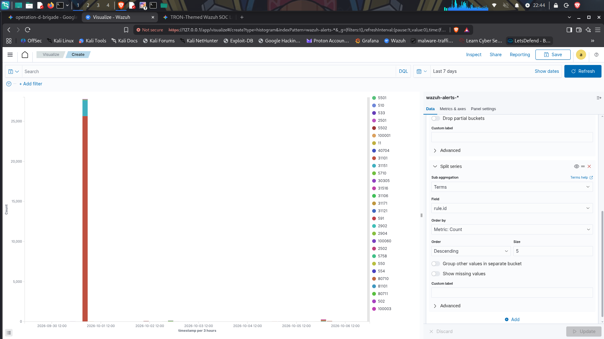

# 🛡️ Operation GRID-SHIELD: TRON-Inspired SOC Telemetry & Automated Incident Response



## Overview

**Operation GRID-SHIELD** is a hybrid threat-detection and automated-remediation lab inspired by the visual aesthetic of *TRON*.

The project combines **Wazuh SIEM**, **Ansible Automation**, and **Wazuh Active Response** to detect network-based attacks, correlate security telemetry, and dynamically contain identified threats.

The lab demonstrates an event-driven defensive workflow:

```text
Attack Activity
      ↓
Wazuh Telemetry
      ↓
Detection & Correlation
      ↓
Active Response
      ↓
Ansible Automation
      ↓
Firewall Containment
      ↓
Remediation Verification
```

---

## 🏗️ Technical Architecture

```text
┌─────────────────────────┐
│     Kali Linux Node     │
│   Red Team / Attacker   │
├─────────────────────────┤
│ • Nmap Recon            │
│ • Gobuster Enumeration  │
│ • Hydra SSH Brute Force │
└────────────┬────────────┘
             │
             │ Attack Traffic
             ▼
┌─────────────────────────────────┐
│   Wazuh Manager / OpenSearch    │
│        "Grid Controller"        │
├─────────────────────────────────┤
│ • Syslog & Auth Log Parsing     │
│ • Custom Detection Rules        │
│ • Alert Correlation             │
│ • Active Response               │
└───────────────┬─────────────────┘
                │
                │ Event / Response
                ▼
┌─────────────────────────────────┐
│      Ansible / AR Engine        │
├─────────────────────────────────┤
│ • Automated Attacker IP Drop    │
│ • Duplicate Block Prevention    │
│ • Remediation Logging           │
└───────────────┬─────────────────┘
                │
                ▼
┌─────────────────────────┐
│       Target Host       │
│   Monitored Endpoint    │
├─────────────────────────┤
│ • Wazuh Agent           │
│ • Active Response       │
│ • Local iptables Rules  │
└─────────────────────────┘
```

---

# 🚨 Incident Response Case Study

## Automated Scanning Detection & Active Response

### Scenario

The primary case study demonstrates the detection and automated mitigation of **web-directory brute-force activity** generated by Gobuster.

The attack traffic was monitored through Apache access logs and evaluated by a custom Wazuh detection rule.

---

## 🔎 Telemetry & Rule Execution Sequence

### Phase 01 — Detection

Custom Wazuh rule **`100003`**:

> `GRID ALERT: Web Application Attack / Scanning Tool Identified`

monitored:

```text
/var/log/apache2/access.log
```

The rule evaluated incoming HTTP requests against a frequency threshold of:

```text
> 50 requests within 10 seconds
```

When the threshold was exceeded, Wazuh generated a high-confidence scanning alert containing the identified attack source.

---

### Phase 02 — Automated Enforcement

The Wazuh daemon, **`wazuh-execd`**, processed the resulting alert and passed the identified attacker IP:

```text
10.0.0.50
```

to:

```text
active-response/bin/firewall-drop
```

The active-response mechanism dynamically added a firewall rule to the `INPUT` chain:

```text
DROP traffic from 10.0.0.50
```

This transformed the detection event into an automated containment action.

---

### Phase 03 — Control Loop & State Management

Concurrent alert triggers were also evaluated by `wazuh-execd`.

During testing, alert counts increased from:

```text
firedtimes: 59 → 60
```

The Active Response control logic used `check_keys` to prevent duplicate containment actions.

This ensured that repeated alerts for the same attacker did not continuously create duplicate firewall rules or introduce unnecessary race conditions.

---

### Phase 04 — Post-Incident Remediation

After the containment test, the automatically created firewall rule was manually removed:

```bash
sudo iptables -D INPUT -s 10.0.0.50 -j DROP
```

This restored the firewall to its default **ACCEPT** baseline without disrupting the monitored service.

---

# 📊 Detection Modules

The project contains multiple attack simulations and corresponding Wazuh detection modules.

| Module | Attack Vector | Associated Rule |
|---|---|---:|
| **Nmap** | Network Reconnaissance | `100201` |
| **Gobuster** | Web Directory Enumeration | `100003` |
| **Hydra** | SSH Authentication Scanning | `57100` |
| **Brute Force** | High-Frequency Authentication Attempts | `100060` |

---

# 📚 Technical Documentation & Module Reports

Detailed reports covering detection logic, decoders, alert payloads, and event correlations are maintained in the `docs/` directory.

| Module Report | Raw Alert Payload | Attack Vector | Rule ID |
|---|---|---|---:|
| `01-wazuh-module-nmap-overview.pdf` | `nmap_wazuh_alert_breakdown.json` | Network Reconnaissance | `100201` |
| `02-wazuh-module-gobuster-overview.pdf` | `gobuster_wazuh_alert_breakdown.json` | Web Directory Enumeration | `100003` |
| `03-wazuh-module-hydra-overview.pdf` | `hydra_wazuh_alert_breakdown.json` | SSH Authentication Scanning | `57100` |
| `04-wazuh-module-brute-force-overview.pdf` | `brute_force_wazuh_alert_breakdown.json` | High-Frequency Brute Force | `100060` |

---

# 🤖 Automated Remediation — Ansible

When Wazuh correlates the high-severity **`100060`** alert, the Active Response workflow invokes the Ansible remediation playbook:

```text
ansible/playbooks/derezz_attacker.yml
```

The playbook performs two primary actions:

1. Blocks the identified attacker IP through `iptables`.
2. Records the remediation event in the local response log.

### Playbook

```yaml
---
- name: Automate Attacker Isolation & Process Remediation
  hosts: monitored_agents
  become: yes

  vars:
    attacker_ip: "{{ ansible_eden_srcip }}"

  tasks:

    - name: Block Attacker IP in IPTables Firewall
      ansible.builtin.iptables:
        chain: INPUT
        source: "{{ attacker_ip }}"
        jump: DROP
        comment: "Automated Ansible Block triggered by Wazuh AR"

    - name: Audit Remediation Log
      ansible.builtin.lineinfile:
        path: /var/log/grid_response.log
        line: "{{ ansible_date_time.iso8601 }} - Attacker IP {{ attacker_ip }} isolated."
        create: yes
```

> **Note:** The variable name `ansible_eden_srcip` is preserved from the project configuration.

---

# 📸 Execution Evidence & Telemetry

Step-by-step execution evidence is maintained in:

```text
screenshots/
```

### Environment Verification

- `01_tree_directories.png`
- Repository directory structure
- Configuration verification

### Nmap Module

- `03_deploy_nmap.png`
- `04_nmap_wazuh_dashboard_pulse.png`
- `05_nmap_wazuh_alert_breakdown.png`

### Gobuster Module

- `deploy_gobuster.png`
- `06_gobuster_wazuh_dashboard_pulse.png`
- `07_gobuster_wazuh_alert_breakdown.png`

### Hydra & Brute Force Modules

Dashboard and telemetry evidence includes:

- `08_*` — Hydra dashboard evidence
- `09_*` — Hydra JSON alert payload
- `10_*` — Brute-force dashboard evidence
- `11_*` — Brute-force JSON alert payload

These artifacts provide visual verification of the detection, alert-generation, and response workflow.

---

# 🔐 Defensive Security Concepts Demonstrated

- SIEM deployment and administration
- Wazuh detection engineering
- Custom correlation rules
- Network reconnaissance detection
- Web attack detection
- SSH brute-force detection
- Active Response automation
- Ansible security automation
- Linux firewall enforcement
- Duplicate-response prevention
- Security telemetry correlation
- Incident containment
- Post-incident remediation
- Evidence preservation and documentation

---

# 🎯 Project Objectives

Operation GRID-SHIELD was designed to demonstrate a complete defensive security control loop:

```text
┌─────────────┐
│   DETECT    │
└──────┬──────┘
       ↓
┌─────────────┐
│   CORRELATE │
└──────┬──────┘
       ↓
┌─────────────┐
│   RESPOND   │
└──────┬──────┘
       ↓
┌─────────────┐
│   CONTAIN   │
└──────┬──────┘
       ↓
┌─────────────┐
│   VERIFY    │
└──────┬──────┘
       ↓
┌─────────────┐
│  DOCUMENT   │
└─────────────┘
```

The project demonstrates how SIEM telemetry can move beyond passive monitoring and become an **event-driven defensive response system**.

---

# 🛡️ Portfolio Takeaway

Operation GRID-SHIELD demonstrates practical experience building and troubleshooting a security monitoring environment where:

**Attack activity → telemetry → detection → correlation → automated response → firewall enforcement → verification**

The project emphasizes the operational side of Blue Team security: **seeing the event, understanding what it means, responding according to defined logic, and proving that the response worked.**

---

## 👨‍💻 Author

**Brandon Lawrence Gregg**

Cybersecurity | Blue Team | SOC Operations | SIEM | Incident Response | Security Automation
